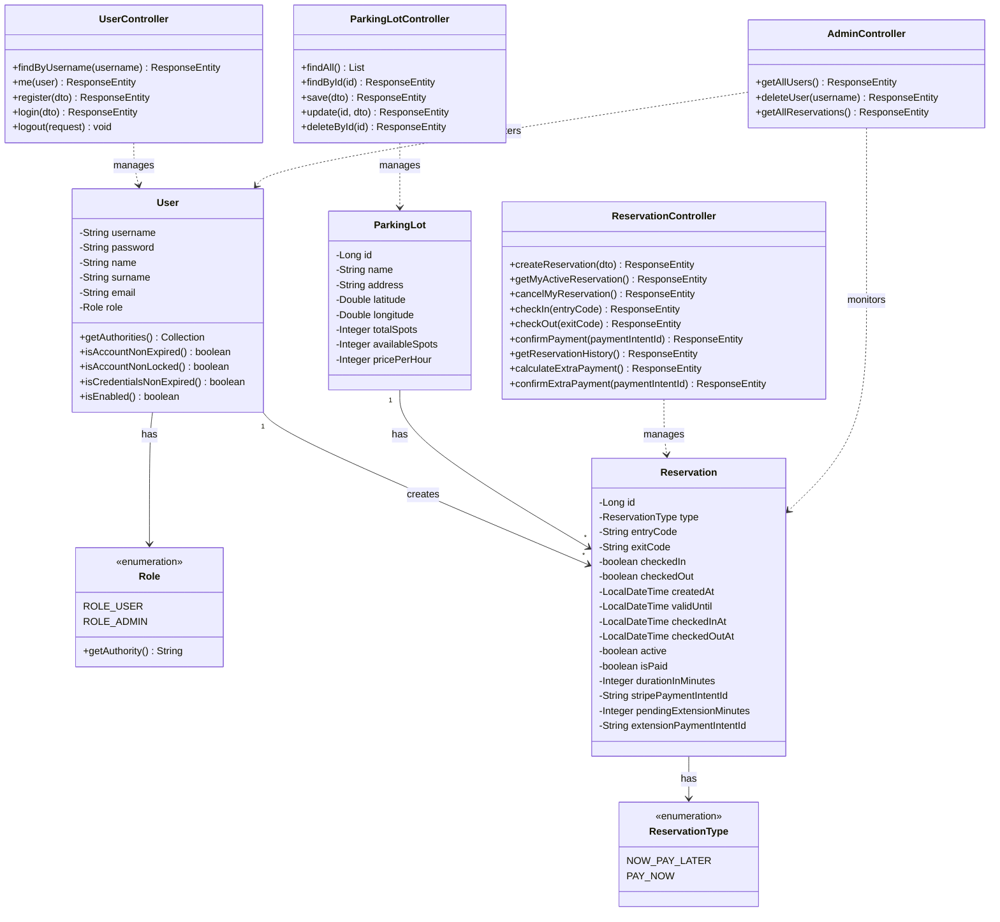
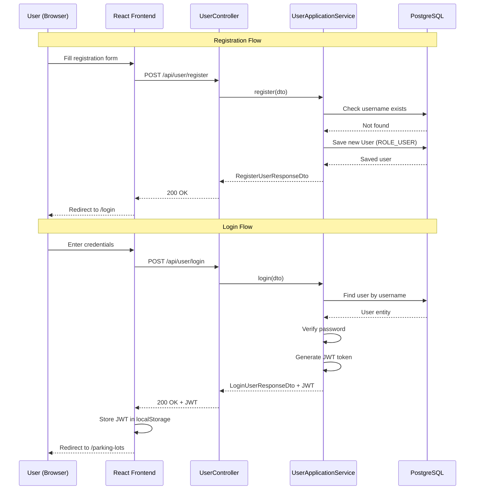
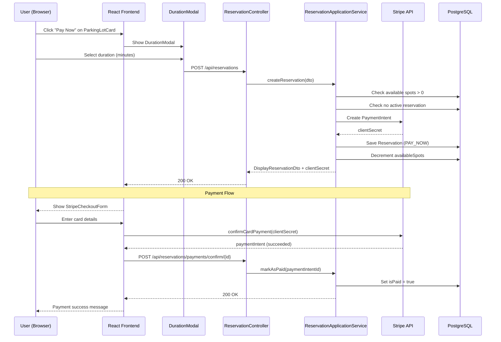
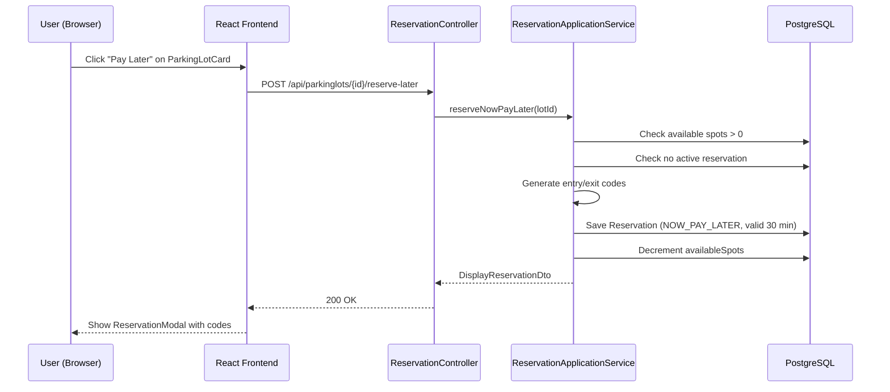
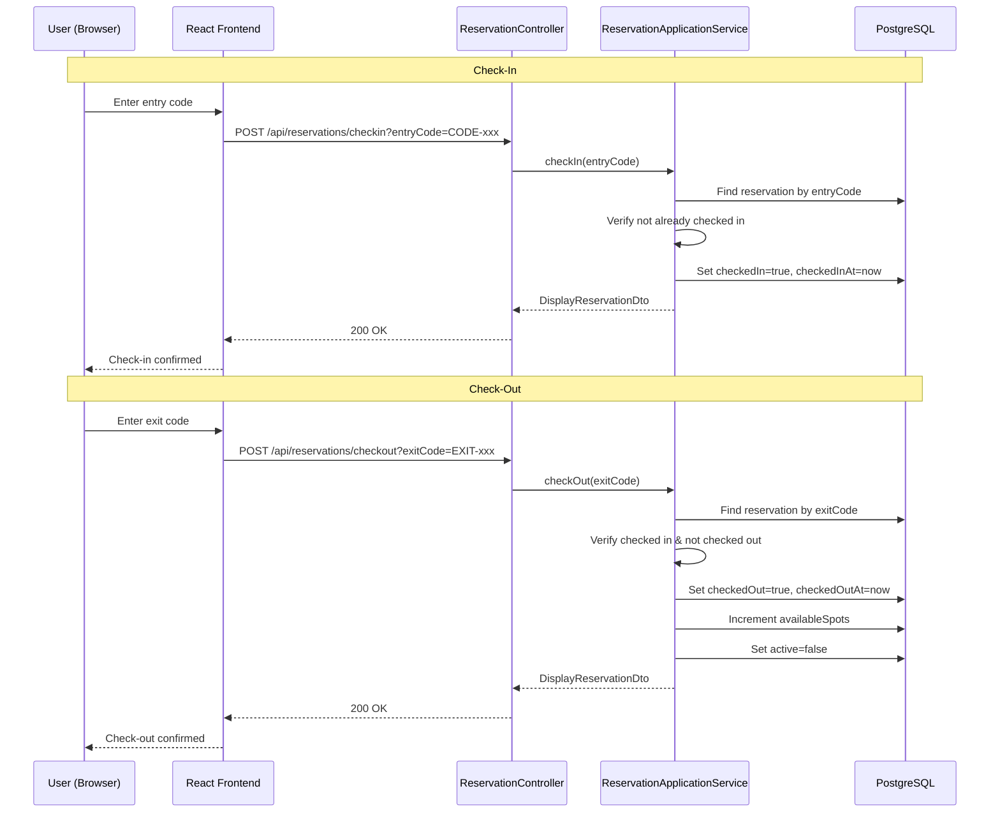
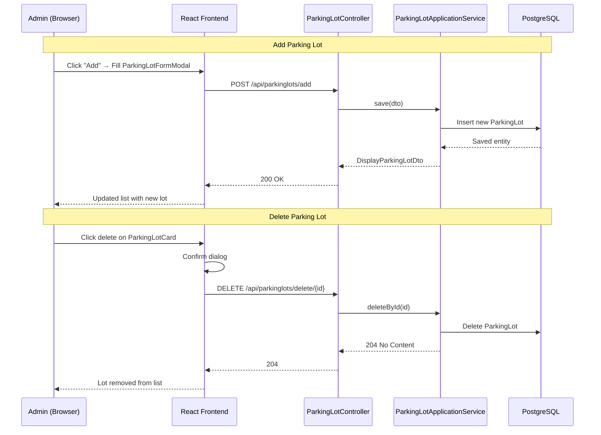
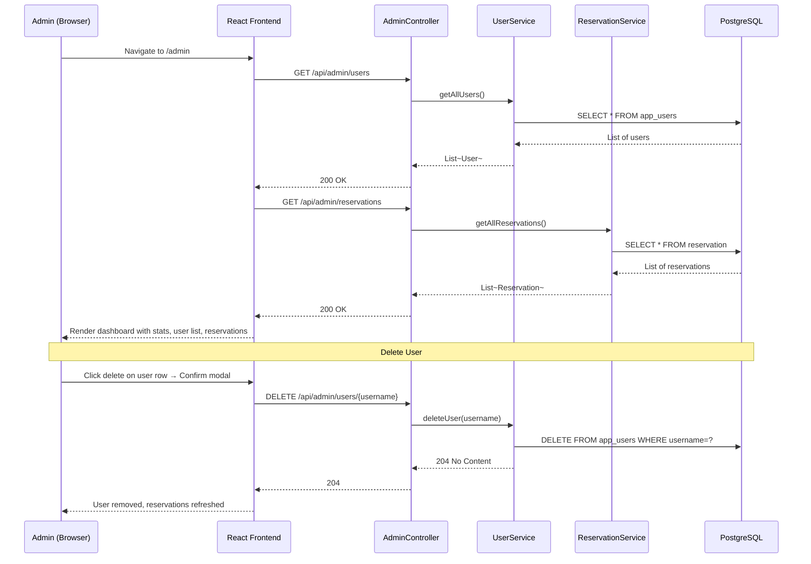

<<<<<<< HEAD
!
=======
# eParking — Smart Parking Reservation System

**eParking** is a full-stack web application that allows users to find, reserve, and pay for parking spots in real time. It provides an interactive map, secure authentication, online payment via Stripe, and an admin dashboard for managing the entire system.

---

## Table of Contents

1. [Technology Stack](#technology-stack)
2. [Project Architecture](#project-architecture)
3. [User Roles & Functionalities](#user-roles--functionalities)
4. [UML Class Diagram](#uml-class-diagram)
5. [UML Sequence Diagrams](#uml-sequence-diagrams)
6. [API Endpoints](#api-endpoints)
7. [Setup & Installation](#setup--installation)

---

## Technology Stack

| Layer | Technology |
|---|---|
| **Backend** | Spring Boot 3.5.3 (Java 21) |
| **Database** | PostgreSQL |
| **Authentication** | JWT (JSON Web Tokens) + Spring Security |
| **Payment** | Stripe API |
| **API Documentation** | SpringDoc OpenAPI (Swagger UI) |
| **Frontend** | React (Vite) |
| **Maps** | Leaflet + OpenStreetMap |
| **Styling** | Tailwind CSS + Custom CSS-in-JS |
| **Routing** | React Router |
| **HTTP Client** | Axios |

---

## Project Architecture

```
┌─────────────────────────────────────────────────────────────────┐
│                        FRONTEND (React)                         │
│  Pages: HomePage, LoginPage, RegisterPage, ParkingLotsPage,    │
│         AdminPage, CheckInPage, MyProfilePage                   │
│  Components: ParkingLotCard, ReservationModal, DurationModal,  │
│              StripeCheckoutForm, ParkingLotFormModal, Header    │
├─────────────────────────────────────────────────────────────────┤
│                     REST API (Spring Boot)                       │
│  Controllers: UserController, ParkingLotController,            │
│               ReservationController, AdminController            │
│  Security: JwtFilter + Spring Security                          │
├─────────────────────────────────────────────────────────────────┤
│                  Service Layer (DDD Pattern)                    │
│  Application Services: UserApplicationService,                 │
│     ParkingLotApplicationService, ReservationApplicationService│
│  Domain Services: UserService, ParkingLotService,              │
│     ReservationService                                         │
├─────────────────────────────────────────────────────────────────┤
│                   PostgreSQL Database                           │
│  Tables: app_users, parking_lot, reservation                    │
└─────────────────────────────────────────────────────────────────┘
```

---

## User Roles & Functionalities

### ROLE_USER (Regular User)

| # | Functionality | Description |
|---|---|---|
| 1 | **Registration** | Create an account with username, name, surname, email, and password |
| 2 | **Login** | Authenticate with username/password and receive a JWT token |
| 3 | **View Parking Lots** | Browse all available parking lots on an interactive map and list |
| 4 | **Search Parking Lots** | Filter parking lots by name |
| 5 | **Find Nearest Lot** | Use geolocation to find the closest parking lot |
| 6 | **Reserve (Pay Later)** | Reserve a spot for 30 minutes and pay on-site |
| 7 | **Reserve & Pay Now** | Reserve a spot and pay immediately via Stripe |
| 8 | **Check-In** | Enter the parking lot using the generated entry code |
| 9 | **Check-Out** | Exit the parking lot using the generated exit code |
| 10 | **View Active Reservation** | View current active reservation details |
| 11 | **Cancel Reservation** | Cancel an active reservation |
| 12 | **Reservation History** | View past reservation history |
| 13 | **Extend Reservation** | Calculate and pay for extra time |
| 14 | **Get Directions** | Open Google Maps directions to a parking lot |
| 15 | **View Profile** | View personal account information |

### ROLE_ADMIN (Administrator)

| # | Functionality | Description |
|---|---|---|
| 1 | **All User Functionalities** | Admins inherit all regular user capabilities |
| 2 | **Admin Dashboard** | View system stats (total users, reservations, active sessions, admin count) |
| 3 | **Manage Users** | View all registered users and search/filter them |
| 4 | **Delete Users** | Remove users and their associated reservations |
| 5 | **Monitor Reservations** | View all reservations across the system with status badges |
| 6 | **Search Reservations** | Filter reservations by user or parking lot |
| 7 | **Add Parking Lot** | Create a new parking lot with location, spots, and pricing |
| 8 | **Edit Parking Lot** | Update existing parking lot details |
| 9 | **Delete Parking Lot** | Remove a parking lot from the system |

---

## UML Class Diagram



---

## UML Sequence Diagrams

### 1. User Registration & Login



### 2. Reserve Parking Spot (Pay Now with Stripe)



### 3. Reserve Parking Spot (Pay Later)



### 4. Check-In & Check-Out



### 5. Admin: Manage Parking Lots



### 6. Admin: Dashboard & User Management



---

## API Endpoints

### User Endpoints (`/api/user`)

| Method | Endpoint | Access | Description |
|--------|---|---|---|
| POST | `/api/user/register` | Public | Register a new user |
| POST | `/api/user/login` | Public | Login and get JWT |
| GET | `/api/user/me` | Authenticated | Get current user info |
| GET | `/api/user/{username}` | Authenticated | Find user by username |
| GET | `/api/user/logout` | Authenticated | Logout (invalidate session) |

### Parking Lot Endpoints (`/api/parkinglots`)

| Method | Endpoint | Access | Description |
|--------|---|---|---|
| GET | `/api/parkinglots` | Public | Get all parking lots |
| GET | `/api/parkinglots/{id}` | Public | Get parking lot by ID |
| POST | `/api/parkinglots/add` | Admin | Add a new parking lot |
| PUT | `/api/parkinglots/edit/{id}` | Admin | Update a parking lot |
| DELETE | `/api/parkinglots/delete/{id}` | Admin | Delete a parking lot |

### Reservation Endpoints (`/api/reservations`)

| Method | Endpoint | Access | Description |
|--------|---|---|---|
| POST | `/api/reservations` | Authenticated | Create a new reservation |
| GET | `/api/reservations/me` | Authenticated | Get active reservation |
| DELETE | `/api/reservations/me` | Authenticated | Cancel active reservation |
| POST | `/api/reservations/checkin` | Authenticated | Check-in with entry code |
| POST | `/api/reservations/checkout` | Authenticated | Check-out with exit code |
| POST | `/api/reservations/payments/confirm/{id}` | Authenticated | Confirm Stripe payment |
| GET | `/api/reservations/history` | Authenticated | Get reservation history |
| POST | `/api/reservations/calculate-extra-payment` | Authenticated | Calculate extension cost |
| POST | `/api/reservations/confirm-extra-payment/{id}` | Authenticated | Confirm extension payment |

### Admin Endpoints (`/api/admin`)

| Method | Endpoint | Access | Description |
|--------|---|---|---|
| GET | `/api/admin/users` | Admin | Get all users |
| DELETE | `/api/admin/users/{username}` | Admin | Delete a user |
| GET | `/api/admin/reservations` | Admin | Get all reservations |

---

## Setup & Installation

### Prerequisites

- **Java 21** (JDK 21+)
- **Node.js 18+** and npm
- **PostgreSQL 15+**
- **Stripe Account** (for payment integration)

### Backend Setup

```bash
# Navigate to backend directory
cd eParking

# Create the PostgreSQL database
# psql -U postgres
# CREATE DATABASE parking;

# Configure database credentials in:
# src/main/resources/application.properties

# Build and run
./mvnw spring-boot:run
```

The backend runs on **http://localhost:8080**

API documentation available at: **http://localhost:8080/swagger-ui.html**

### Frontend Setup

```bash
# Navigate to frontend directory
cd eparking-frontend

# Install dependencies
npm install

# Start development server
npm run dev
```

The frontend runs on **http://localhost:5173**

### Environment Variables

| Variable | Description |
|---|---|
| `STRIPE_API_KEY` | Stripe secret key for payment processing |
| `STRIPE_WEBHOOK_SECRET` | Stripe webhook signing secret |

---

## Project Structure

```
eParking/
├── eParking/                          # Backend (Spring Boot)
│   ├── src/main/java/.../
│   │   ├── config/                    # Security, Web, OpenAPI config
│   │   ├── constants/                 # JWT constants
│   │   ├── dto/                       # Data Transfer Objects
│   │   ├── helpers/                   # JWT helper utilities
│   │   ├── init/                      # Data initializer
│   │   ├── model/                     # JPA entities & enums
│   │   ├── repository/                # Spring Data JPA repositories
│   │   ├── service/
│   │   │   ├── application/           # Application services (orchestration)
│   │   │   └── domain/               # Domain services (business logic)
│   │   └── web/                       # REST controllers & filters
│   └── src/main/resources/
│       └── application.properties
│
├── eparking-frontend/                 # Frontend (React + Vite)
│   ├── src/
│   │   ├── api/                       # Axios instance config
│   │   ├── components/                # Reusable UI components
│   │   ├── context/                   # React context providers
│   │   ├── pages/                     # Page components
│   │   ├── repository/                # API call functions
│   │   └── utils/                     # JWT utilities
│   └── package.json
│
└── README.md
```
>>>>>>> 27417d2 (add docker file and deploy it in railway)
